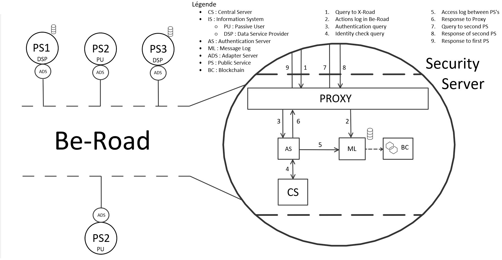
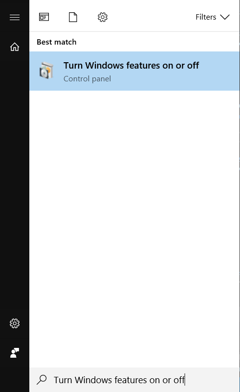
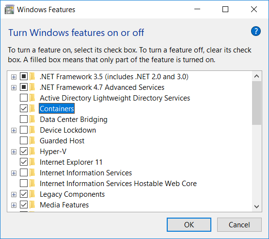

# Introduction 
In Belgium, public services interact with each others directly. For example, when a hospital need to know your National Identification Number, it's administration will access you town administration services. This access is marked with a reason.

Privacy Passport is a portal on which any Belgian citizen can connect to with their e-ID in order to see all these accesses.

But this project is not only about that portal. It also contains a hole system through which the public services should be going in order to communicate. This central point redirects requests between public services and log these accesses in a private blockchain.

This project is a prototype that will be used to show the usability of this system.

It currently contains : 
* the Privacy Passport portal
* a mocked public service
* the central system connected to the blockchain (Be-road)

The following chart represents the infrastructure of Be-Road.



The blockchain genesis is stored on a VM on Azure.

The public services are able to communicate through Be-Road using contracts. Find more about them in [the 3rd section below](#how-to-create-and-use-contracts).

# Getting Started
## Summary
1.	[Clone the code](#clone-the-code)
2.  [Blockchain implementation](#blockchain-implementation)
3.  [How to create and use contracts](#how-to-create-and-use-contracts)
4.  [Call to MessageLog API](#call-to-messagelog-api)
5.	[Latest releases](#latest-releases)

### Clone the code
To get the websites and the central part on your machine, you just have to clone the project in your git.
The solution contains 9 projects :
* ADSMock (Mock of the Adapter Servers)
* BeRoadTest (Unit test project)
* CenterServer (Handle Contracts ands ADS)
* ConsoleTesting (A console project for quickly test some features)
* Contracts (A class library that contains the logic for contracts)
* MessageLog (Logging API with blockchain implementation)
* Proxy (Proxy that handle inputs to BeRoad)
* PublicService (the public service mock)
* Web (The privacy passport portal)

#### How to build
The projetc contains a docker-compose file that will be used to build the project.
First you need to install Docker on your PC from the [Docker website](https://docs.docker.com/docker-for-windows/install/).
After this you need to enable the container feature like the following.

Search the windows features as done below :


Check the "Containers" feature then click "OK" : 


[Here](https://dotnetthoughts.net/dockerize-an-existing-aspnet-mvc5-application/) is a tutorial explaining some things that are great to know about Docker.
To build and run every component, set the docker-compose as startup project and hit run.
The first time you run the project, Docker will download all the images needed. This may take some time.

##### Docker
Ip addresses
- **Proxy**: 172.16.42.10
- **CentralServer**: 172.16.42.11
- **ADSMock**: 172.16.42.12
- **MessageLog**: 172.16.42.13
- **Web**: 172.16.42.14

This project requires two extra docker-compose files, docker-compose.override.yml and docker-compose.prod.yml.
Add theses two files on the root folder and then unload and reload the docker-compose project in order to load these files.

Compose files
- docker-compose.override.yml
  - Used for development
- docker-compose.prod.yml
  - Used for production 

These files look like this.
```
version: '3'

services:
  proxy:
    ports:
      - "3000"

  centralserver:
    environment:
      - ContractContext= <InsertYourConnectionStringHere>
    ports:
      - "3001"

  adsmock:
    ports:
      - "3002"
  
  messagelog:
    environment:
      - LogContext= <InsertYourConnectionStringHere>
      - Hostname=<...>
      - Port=<...>
      - Username=<...>
      - Password=<...>
      - ChainName=<...>
      - BurnAddress=<...>
      - RootNodeAddress=<...>
    ports:
      - "3003"

  web:
    environment:
      - PSContext= <InsertYourConnectionStringHere>
    ports:
      - "3004"


```


To build on command line use this: 
```
docker-compose 
    -f "...\docker-compose.yml" 
    -f "...\docker-compose.override.yml" 
    -p prodcompose up 
```


##### Entity Framework
Be-Road currently contains two Database Contexts that need a connection string
- Central Server
- Message Log

The connection strings need to be defined in the docker-compose.yml
To add a migration or update a database, you need to to set the **project as startup** and as **default project** in the package manager console.
After this you need to specify the connection string as well as the data provider when running the migrations commands.

Example: 
```
Add-Migration MigrationName -Verbose -ConnectionString "..." -ConnectionProviderName "System.Data.SqlClient"
```
```
Update-Database -Verbose -ConnectionString "..." -ConnectionProviderName "System.Data.SqlClient"
```

### Blockchain implementation
The blockchain is a prototype too. In the final project, it will be done later by more advanced developers, it will certainly be created from scratch.

Currently, we used Multichain to create our private blockchain. For advanced knowledge on how to create your own blockchain with multichain, check their [website](https://www.multichain.com/).

To implement a multichain blockchain in the project, we used a NuGet package called LucidOcean.Multichain ([GitHub](https://github.com/LucidOcean/multichain)) that gathers a set of class to call the RPC API of your blockchain, and so controlling it from the outside.

Then you just have to change the data in the docker-compose.override.yml file : 

```
messagelog:
    environment:
      - Hostname={IP address}
      - Port={port}
      - Username={rpc username (usually multichainrpc)}
      - Password={rpc password}
      - ChainName={blockchain name}
      - BurnAddress={burn address}
      - RootNodeAddress={any wallet address on your genesis}
```

If you have problems understanding these, check [multichain documentation](https://www.multichain.com/developers/).
You have to create yout focker files as said in the [Docker](#docker) section.

### How to create and use contracts
Contracts are JSON bits of code serialized and deserialized in C#. They have inputs, outputs, and a body made of queries.

They work like functions that can call other contracts. Their inputs are parameters that the target needs to retreive the date. The outputs are the information that was asked. The querries are not always necessary. You will use these those when you miss data that are stored in other services. They call other contracts passing inouts to them.

The contracts are created in Be-Road with recommandations asked to services.

If a contract contains a input with key **Justification** and **Justification**, every call to this contract will be stored in a database and in a blockchain.

#### Example
##### Without queries

JSON :
```json
{
    "Id": "GetOwnerIdByDogId",
    "Description": "This contract is used to get the dog owner id",
    "Version": "V001",
    "Inputs": [
        {
            "Type": "String",
            "Key": "DogID",
            "Required": true,
            "Description": "The ID of the Dog"
        }
    ],
    "Queries": [],
    "Outputs": [
        {
            "LookupInputId": "0",
            "Type": "String",
            "Description": "The ID of the owner of the dog",
            "Key": "OwnerIDOfTheDog"
        }
    ]
}
```
C# :
```csharp
var GetDogOwnerContract = new BeContract()
{
    Id = "GetOwnerIdByDogId",
    Description = "This contract is used to get the dog owner id",
    Version = "V001",
    Inputs = new List<Input>()
    {
        new Input()
        {
            Key = "DogID",
            Description = "The ID of the Dog",
            Required = true,
            Type = typeof(string)
        }
    },
};
GetDogOwnerContract.Queries = new List<Query>();
GetDogOwnerContract.Outputs = new List<Output>()
{
    new Output()
    {
        LookupInputId = 0,
        Key = "OwnerIDOfTheDog",
        Description = "The ID of the owner of the dog",
        Type = typeof(string)
    }
};
```

##### With queries

```json
{
    "Id": "GetAddressByDogId",
    "Description": "This contract is used to get the address by dog id",
    "Version": "V001",
    "Inputs": [
        {
            "Type": "String",
            "Key": "MyDogID",
            "Required": true,
            "Description": "The ID of the Dog"
        }
    ],
    "Queries": [
        {
            "Contract": "GetOwnerIdByDogId",
            "Mappings": [
                {
                    "InputKey": "DogID",
                    "LookupInputId": "0",
                    "LookupInputKey": "MyDogID"
                }
            ]
        },
        {
            "Contract": "GetAddressByOwnerId",
            "Mappings": [
                {
                    "InputKey": "OwnerID",
                    "LookupInputId": "1",
                    "LookupInputKey": "OwnerIDOfTheDog"
                }
            ]
        }
    ],
    "Outputs": [
        {
            "LookupInputId": "1",
             "Type": "String",
             "Description": "Street name",
             "Key": "Street"
        },
        {
             "LookupInputId": "1",
             "Type": "Int32",
             "Description": "Street number",
             "Key": "StreetNumber"
       },
       {
             "LookupInputId": "1",
             "Type": "String",
             "Description": "Country of the address",
             "Key": "Country"
       }
    ]
}
```

```csharp
var GetAddressByOwnerContract = GetAddressByOwnerId();
var GetOwnerIdByDogContract = GetOwnerIdByDogId();

var GetAddressByDogContract = new BeContract()
{
    Id = "GetAddressByDogId",
    Description = "This contract is used to get the address by dog id",
    Version = "V001",
    Inputs = new List<Input>()
    {
        new Input()
        {
            Key = "MyDogID",
            Description = "The ID of the Dog",
            Required = true,
            Type = typeof(string)
        }
    },
};

GetAddressByDogContract.Queries = new List<Query>()
{
    new Query()
    {
        Contract = GetOwnerIdByDogContract,
        Mappings = new List<Mapping>()
        {
            new Mapping()
            {
                InputKey = "DogID",
                LookupInputId = 0,
                LookupInputKey = "MyDogID"
            }
        }
    },
    new Query()
    {
        Contract = GetAddressByOwnerContract,
        Mappings = new List<Mapping>()
        {
            new Mapping()
            {
                InputKey = "OwnerID",
                LookupInputId = 1,
                LookupInputKey = "OwnerIDOfTheDog"
            }
        }
    }
};

GetAddressByDogContract.Outputs = new List<Output>()
{
    new Output()
    {
        LookupInputId = 1,
        Key = "Street",
        Description = "Street name",
        Type = typeof(string)
    },
    new Output()
    {
        LookupInputId = 1,
        Key = "StreetNumber",
        Description = "Street number",
        Type = typeof(int)
    },
    new Output()
    {
        LookupInputId = 1,
        Key = "Country",
        Description = "Country of the address",
        Type = typeof(string)
    }
};
```

Contracts are added in a database so that they can be used either directly or via queries.

### Call to MessageLog API
The log feature of Be-Road is handle by the MessageLog project. It uses an API to be accessed. Here are the different routes to call in the API and their purpose : 
<table>
    <tr>
        <th>Root</th>
        <th>Controller</th>
        <th>Action</th>
        <th>Parameters</th>
    </tr>
    <tr>
        <td rowspan="15">/api</td>
        <td rowspan="4">/Contract</td>
        <td><strong>/Get/{page}</strong> : Returns a number of contract logs</td>
        <td>
            <strong>Page</strong> : Number of the page to return. One page is 50 logs.
        </td>
    </tr>
    <tr>
        <td><strong>/Add</strong> : Logs a contract creation</td>
        <td>
            <strong>ContractId</strong> : Id of the contract
            <br />
            <strong>UserName</strong> : Name of the system user (IS)
        </td>
    </tr>
    <tr>
        <td><strong>/Delete</strong> : Logs a contract removal</td>
        <td>
            <strong>ContractId</strong> : Id of the contract
            <br />
            <strong>UserName</strong> : Name of the system user (IS)
        </td>
    </tr>
    <tr>
        <td><strong>/Call</strong> : Logs a contract call</td>
        <td>
            <strong>ContractId</strong> : Id of the contract
            <br />
            <strong>UserName</strong> : Name of the system user (IS)
            <br />
            <strong>UserType</strong> : Type of the system user (Passive user, data provider, ...)
            <br />            
            <strong>Response</strong> : Is a response to another call (boolean)
        </td>
    </tr>
    <tr>
        <td rowspan="4">/AdapterServer</td>
        <td><strong>/Get/{page}</strong> : Returns a number of adapater server logs</td>
        <td>
            <strong>Page</strong> : Number of the page to return. One page is 50 logs.
        </td>
    </tr>
    <tr>
        <td><strong>/Add</strong> : Logs an adapter server creation</td>
        <td>
            <strong>UserName</strong> : Name of the system user (IS)
            <br />
            <strong>UserType</strong> : Type of the system user (Passive user, data provider, ...)
        </td>
    </tr>
    <tr>
        <td><strong>/Update</strong> : Logs a contract update</td>
        <td>
            <strong>UserName</strong> : Id of the contract
            <br />
            <strong>UserType</strong> : Type of the system user (Passive user, data provider, ...)
        </td>
    </tr>
    <tr>
        <td><strong>/Delete</strong> : Logs a contract removal</td>
        <td>
            <strong>UserName</strong> : Name of the system user (IS)
        </td>
    </tr>
    <tr>
        <td rowspan="2">/Exception</td>
        <td><strong>/Get/{page}</strong> : Returns a number of exception logs</td>
        <td>
            <strong>Page</strong> : Number of the page to return. One page is 50 logs.
        </td>
    </tr>
    <tr>
        <td><strong>/Call</strong> : Logs an exception call</td>
        <td>
            <strong>UserName</strong> : Name of the system user (IS)
            <br />
            <strong>UserType</strong> : Type of the system user (Passive user, data provider, ...)
            <br />
            <strong>Message</strong> : Message contained in the exception 
        </td>
    </tr>
</table>

### Last releases
#### 0.6.0 - 24th April 2018
##### Privacy Passport
* Plug to Be-Road : using BeContracts
* Design upgrade

##### Public Service
* Plug to Be-Road : using BeContracts
* Contract restriction : each IS can only access some BeContract

##### Message Log
* Log every request to and from the system

#### 0.5.0 - 24th April 2018
##### All
* Add Docker and adpat the project to it

##### Central Server
* BeContract Creator
* Adapter Server Creator

#### 0.4.0 - 10th April 2018
##### Contracts
* BeContract System

##### ADS Mock
* Communication through be-Road : With BeContracts
* Call other Information System contracts

#### 0.3.0 - 20th March 2018
##### All
* Different working enviroments : Devlopement, Staging
* User account : Added NISS

##### Message Log
* Rest API : To call the Message Log
* Database : To log the accesses
* Route : To add the data
* Hash : To hide the data
* Blockchain : To log the accesses

#### 0.2.0 - 7th March 2018
##### Public Service
* Register page : e-ID account creation
* Login page : username and password
* Account managing page : Add more details to your account
* User search page : Find the user you want to see the data about
* Reason modals : Enter the reason why you want to access the data
* User details page : See the information of the user when you gave the reason
* GDPR information page : Check the GDPR compliance of the website
* Recurring job : Export database every day
* Rest API : To make the data open
* Swagger : API documentation

#### 0.1.0 - 19th February 2018
##### Privacy Passport
* Login page : e-ID connection
* Home page : Public services data sources
* Data page : Data possessed by a the selected public service
* Details modal : Accesses on the selected piece of data